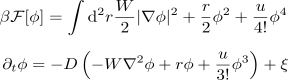
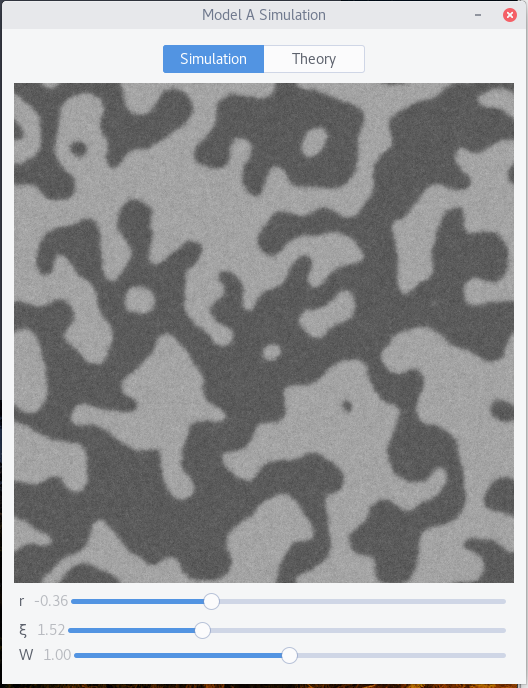

# Model A Simulation

Model A Simulation is a GTK application that runs a real-time simulation of a phi^4 theory with adjustable sliders to change the parameters. The free energy and equation of motion are as follows:



This program runs a 2D version of this model and allows you to change the noise strength, surface tension and free energy of mixing
parameters as the simulation runs to get an idea of the behaviour under these changes.

## Compiling and running

You'll require the Vala compiler (valac) and the following libraries to build the application:

 - GTK+ 3.0
 - Cairo
 - Gdk 3.0
 - GSL
 - Webkit2

Once you have the requirements installed. Clone the repository, run `make`, and launch the program

```
$ git clone https://github.com/nsmith5/Model-A-Simulation.git
$ cd Model-A-Simulation
$ make
$ ./Model-A-Simulation
```

You should see a window open with the simulation running



Slide around the parameters and see what happens!

## Contact & Feedback

'Model A Simulation' was written in Vala by Nathan Smith (nathan.smith5 at mcgill dot ca). If you find bugs or have questions email me!

